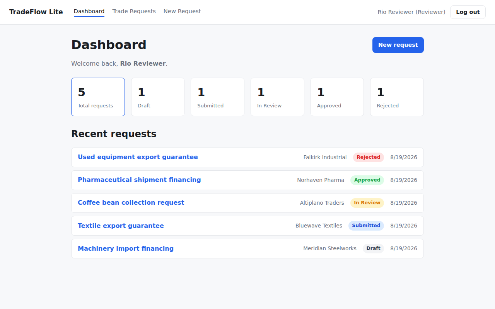
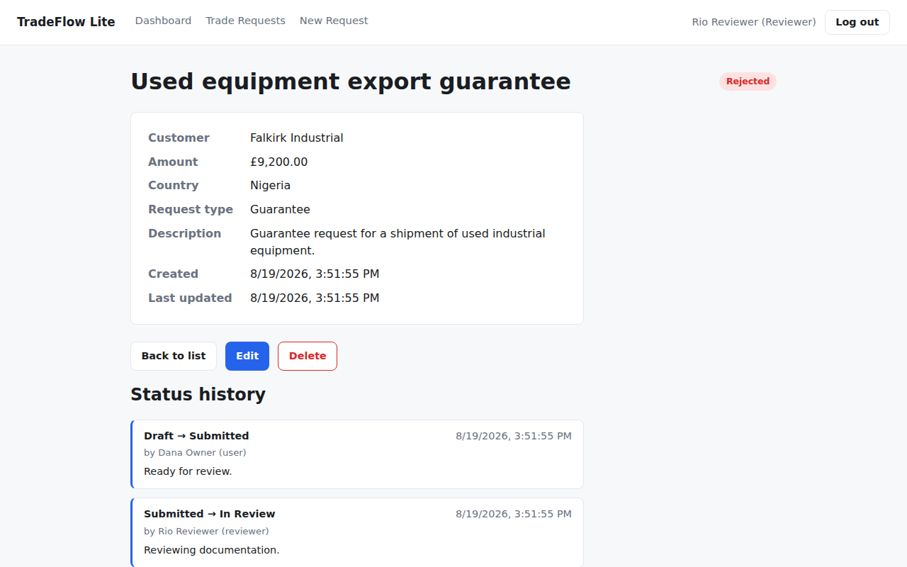
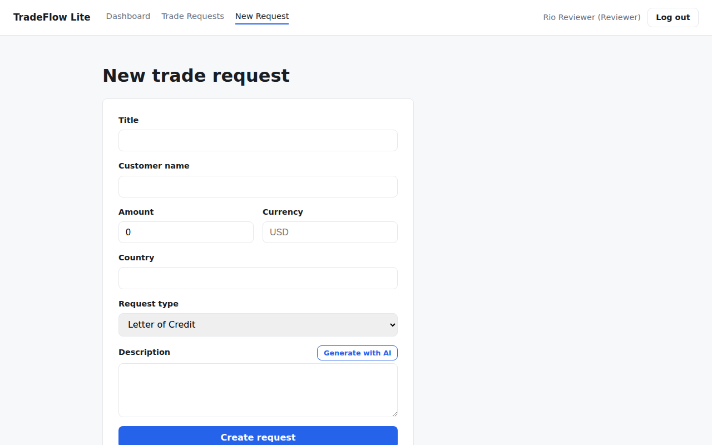
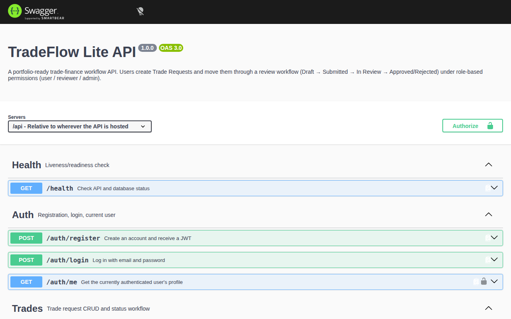

# TradeFlow Lite

A portfolio-ready, full-stack workflow management app inspired by trade-finance
processes. Users register, create **Trade Requests** (Letter of Credit,
Guarantee, Collection, Other), and move them through a review workflow —
**Draft → Submitted → In Review → Approved/Rejected** — while reviewers and
admins act on them under role-based permissions.

This is a technical portfolio project. It does not model real financial
regulation.

> **Status:** All 11 phases complete — the full application, a full test
> suite (42 server + 22 client + 8 E2E), production-reliability basics, a
> full Docker setup (`docker compose up --build` runs client + server +
> MongoDB together), a GitHub Actions CI pipeline, an optional AI-assisted
> description generator backed by a local Ollama model, interactive API
> docs (`GET /api/docs`), and a one-command demo seed script. See
> [docs/learning-notes.md](docs/learning-notes.md) for phase-by-phase
> progress and [docs](docs) for the full learning material.

## Screenshots

| Dashboard | Trade details |
| --- | --- |
|  |  |

| New trade request (with AI description) | Interactive API docs |
| --- | --- |
|  |  |

## Stack

| Layer      | Technology                                                                 |
| ---------- | --------------------------------------------------------------------------- |
| Frontend   | React, TypeScript, Vite, React Router, React Hook Form, Zod, TanStack Query |
| Backend    | Node.js, TypeScript, Express, MongoDB, Mongoose, Zod, JWT, bcrypt, pino     |
| Testing    | Vitest, React Testing Library, Supertest, Playwright                        |
| Engineering| ESLint, Prettier, Docker, Docker Compose, GitHub Actions, Swagger/OpenAPI   |
| Optional AI| Ollama (local, open-source model — never a paid API)                       |

## Project structure

```
tradeflow-lite/
  client/   React + Vite + TypeScript frontend
  server/   Node + Express + TypeScript API
  e2e/      Playwright end-to-end tests (Page Object Model)
  docs/     Learning notes, cheat sheets, architecture, interview prep
```

Each side keeps a clean layering: **UI → API client → React Query/hooks**
on the frontend, and **route → controller → service → model** on the
backend. See [docs/architecture.md](docs/architecture.md) for a diagram.

## Getting started

### Prerequisites

- Node.js 20+
- A running MongoDB instance (local install, Docker, or Atlas)

### 1. Install dependencies

```bash
npm install
```

This installs both `client/` and `server/` workspaces from the repo root
(npm workspaces).

### 2. Configure environment variables

```bash
cp server/.env.example server/.env
cp client/.env.example client/.env
```

Edit `server/.env` if your MongoDB instance isn't at the default
`mongodb://localhost:27017/tradeflow-lite`, and set a real `JWT_SECRET`.
`OLLAMA_BASE_URL`/`OLLAMA_MODEL` are optional — only needed for the
"Generate with AI" description button (see below); the app works fully
without them.

### 3. Run the app

```bash
npm run dev:server   # http://localhost:4000
npm run dev:client   # http://localhost:5173
```

Open http://localhost:5173 — the page pings `/api/health` on the server
and shows the API/DB status, proving the two are wired together.

### 4. (Optional) Load demo data

```bash
npm run seed --workspace server
```

Wipes and repopulates the database with three demo accounts (one per role)
and five trade requests spanning every workflow status — see
[Demo accounts](#demo-accounts) below. Refuses to run if
`NODE_ENV=production`.

### 5. Verify everything works

```bash
npm run lint
npm run typecheck
npm run build
npm run test           # server + client unit/integration tests
npm run test:e2e       # Playwright E2E suite (starts its own real servers + in-memory MongoDB)
```

## Run with Docker

No local Node.js or MongoDB install needed — everything runs in containers:

```bash
docker compose up --build
```

- Client: http://localhost:5173
- Server: http://localhost:4000
- MongoDB: exposed on `localhost:27017` (data persisted in a named volume)

Set `JWT_SECRET` in a root `.env` file (see `.env.example`) to override the
demo default. `docker compose down -v` stops everything and removes the
MongoDB volume.

## Optional: AI-assisted description generation

The trade request form has a "Generate with AI" button that drafts a
description from whatever fields are already filled in, using a locally
running [Ollama](https://ollama.com) model — no paid API, no account, no
data leaving your machine.

```bash
ollama pull llama3.2   # or set OLLAMA_MODEL to whatever you've pulled
ollama serve
```

This is entirely optional: with Ollama not running, the button shows a
small inline notice and the rest of the form works identically.

## Demo accounts

After running the seed script (`npm run seed --workspace server`), these
accounts are ready to use — all share the password `demo-password-123`:

| Email | Role | Notes |
| --- | --- | --- |
| `user@tradeflow.demo` | user | Owns all five seeded trade requests |
| `reviewer@tradeflow.demo` | reviewer | Can move requests through review |
| `admin@tradeflow.demo` | admin | Sees and can act on everything |

## Quick health check

```bash
curl http://localhost:4000/api/health
```

```json
{ "status": "ok", "db": "connected", "uptimeSeconds": 12, "timestamp": "…" }
```

## API documentation

Interactive Swagger/OpenAPI docs are served at `/api/docs`
(http://localhost:4000/api/docs when running locally) — every endpoint,
request/response shape, and status code, generated from
[server/src/docs/openapi.ts](server/src/docs/openapi.ts).

## Documentation

- [docs/architecture.md](docs/architecture.md) — system diagram and data flow
- [docs/learning-notes.md](docs/learning-notes.md) — what was built and learned, phase by phase
- [docs/commands-cheatsheet.md](docs/commands-cheatsheet.md) — every command used in this repo
- [docs/interview-cheatsheet.md](docs/interview-cheatsheet.md) — quick interview reference by topic
- [docs/topic-tips-and-interview-questions.md](docs/topic-tips-and-interview-questions.md) — deep dive per topic
- [docs/interview-question-bank.md](docs/interview-question-bank.md) — growing Q&A bank
- [docs/interview-demo-script.md](docs/interview-demo-script.md) — a live-demo walkthrough for interviews
- [docs/final-fullstack-interview-prep.md](docs/final-fullstack-interview-prep.md) — 50-question full-stack review
- [docs/cv-description.md](docs/cv-description.md) — resume/CV blurbs for this project

## Deployment

There's no live deployment for this portfolio project, but the Docker setup
is deploy-ready as-is:

1. Push `server/Dockerfile` and `client/Dockerfile` images to a registry (or
   build directly on the host) and run them with `docker-compose.yml` as a
   starting point — most container platforms (Fly.io, Render, Railway, a
   plain VPS with Docker Compose) can take this directly.
2. Use a managed MongoDB (e.g. [MongoDB Atlas](https://www.mongodb.com/atlas))
   instead of the `mongo` service for anything beyond a local demo, and set
   `MONGODB_URI` accordingly.
3. Set real values for `JWT_SECRET` (long, random) and `CORS_ORIGIN` (the
   deployed frontend's actual origin) as environment variables — never
   commit them.
4. Terminate TLS in front of the app (a platform load balancer, or nginx/
   Caddy) — `helmet`'s HSTS header is already gated on `NODE_ENV=production`
   and only makes sense once real HTTPS is in place.
5. Point CI (`.github/workflows/ci.yml`) at a deploy step once a real target
   exists — today it stops at a verified build, deliberately, since there's
   nothing to ship to yet.

## Known limitations

- This is a demo app: no real payment rails, no real KYC/compliance logic.
- Optional AI requires a local [Ollama](https://ollama.com) install; the
  app works fully without it.
- No refresh tokens: a JWT is valid for `JWT_EXPIRES_IN` (default `1d`) and
  then requires logging in again — acceptable for a demo, not for a
  long-lived production session.
- No file/document attachments on a trade request — a real trade-finance
  workflow would need supporting documents (invoices, bills of lading).
- No pagination on `StatusHistory`/audit trail — fine at this project's
  scale, would need it for a request with a very long history.
- Single MongoDB instance, no replica set — fine for a demo/portfolio
  deployment, not for production durability guarantees.

## Future improvements

- Refresh tokens + silent re-auth, instead of a single long-lived JWT.
- File attachments on trade requests (with size/type validation and
  virus scanning in a real deployment).
- Reviewer assignment (instead of any reviewer being able to act on any
  submitted request) and email/webhook notifications on status changes.
- Optimistic UI updates for status transitions, with rollback on failure.
- A `docker` job in CI that builds (not just lints/tests) the Docker images
  on every PR, catching Dockerfile regressions before merge.
- Rate limiting beyond just auth endpoints, tuned per-route by cost.

## License

Portfolio project — no license restrictions implied beyond showcasing the code.
