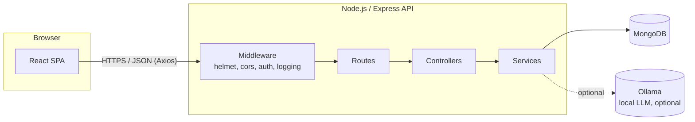
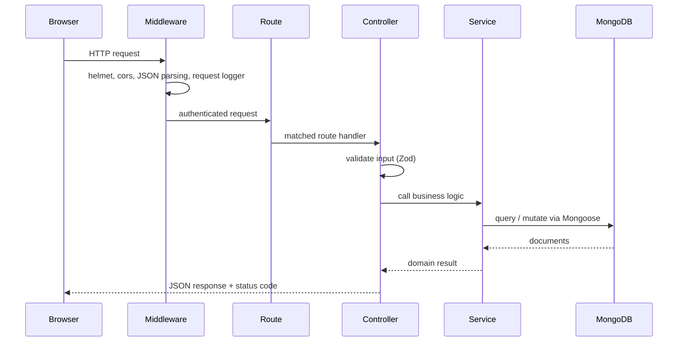
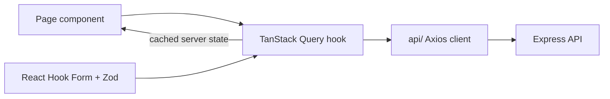
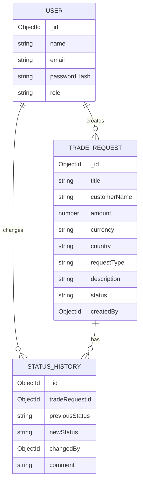
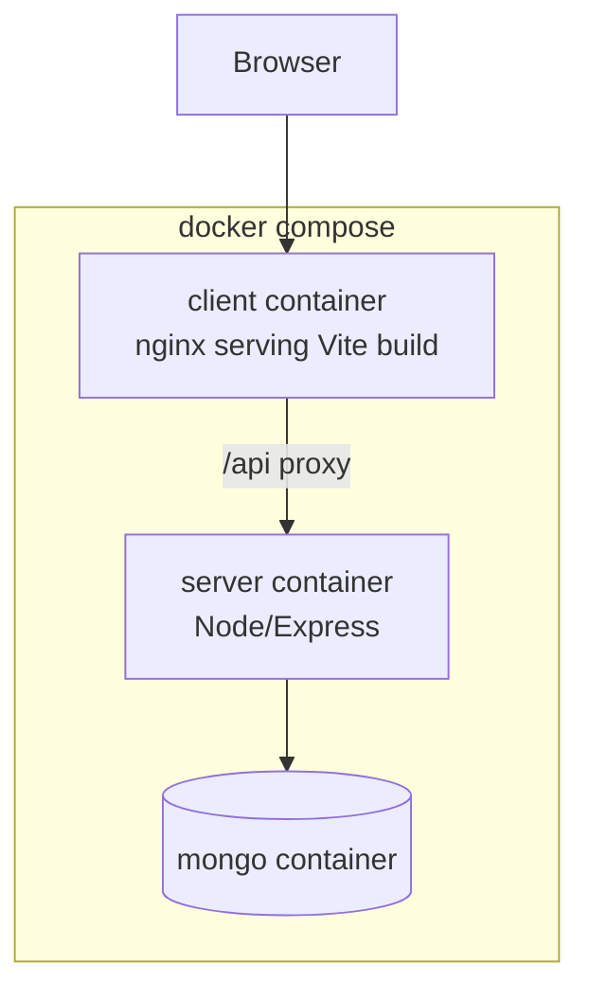

# Architecture

## High-level system

## Request lifecycle

Every API request flows through the same layers, in the same order:

**Why this layering?** Each layer has one job:

- **Routes** just map an HTTP verb + path to a controller — no logic.
- **Controllers** parse/validate the request and shape the response — no DB calls.
- **Services** hold business rules (e.g. "only a reviewer can approve") and talk to MongoDB.
- **Models** (Mongoose schemas) define the shape of data and DB-level validation.

This keeps each piece independently testable: services can be unit tested without
spinning up Express, and controllers can be tested with a mocked service.

## Frontend data flow

- **Server state** (trades, dashboard stats, current user) lives in TanStack Query —
  it owns caching, loading/error states, and refetching.
- **Client/UI state** (form inputs before submit, modal open/closed, filters typed
  but not yet applied) lives in local `useState`/`useReducer`.

## Data model

## Deployment shape (Docker Compose, Phase 8)

This document grows as later phases (auth, RBAC, analytics, Docker, CI/CD) add
new pieces to the system.
